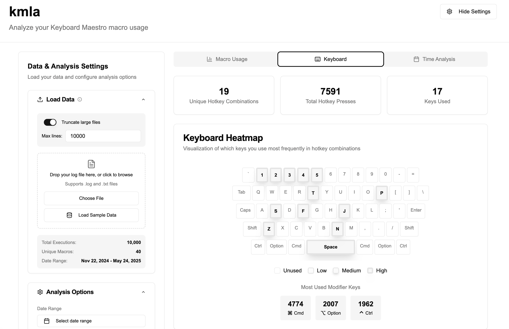
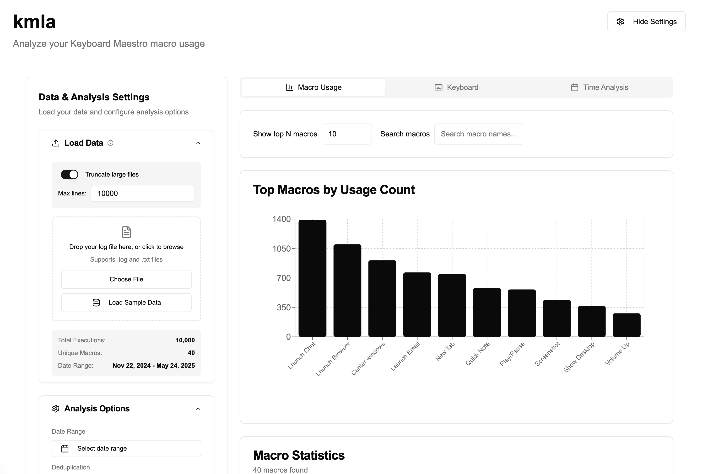
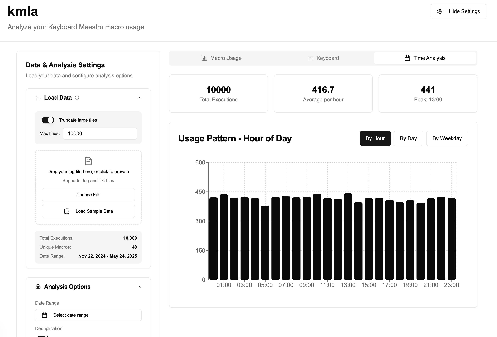

# kmla

A simple analysis tool for Keyboard Maestro usage logs on macro usage, keyboard activity, and time patterns.

[](https://vercel.com/jyang-default/kmla)
[](https://v0.dev/chat/projects/9jednIVl57y)

<p align="center">
  
</p>

<details>
<summary>More screenshots</summary>
  <p align="center">
    
  </p>
  <p align="center">
    
  </p>
</details>

## Quick Start

[v0 deployment](https://kmla-jyang-default.vercel.app)

### Run locally

```bash
git clone https://github.com/Joilence/kmla.git
cd kmla

# install bun
brew tap oven-sh/bun
brew install bun

# install dependencies
bun install

# run the app
bun dev
```

## Usage

Upload log file from: `~/Library/Logs/Keyboard Maestro/Engine.log`, and explore the data.

## Development

This project was initially built with [v0.dev](https://v0.dev), and continued crafting locally.
